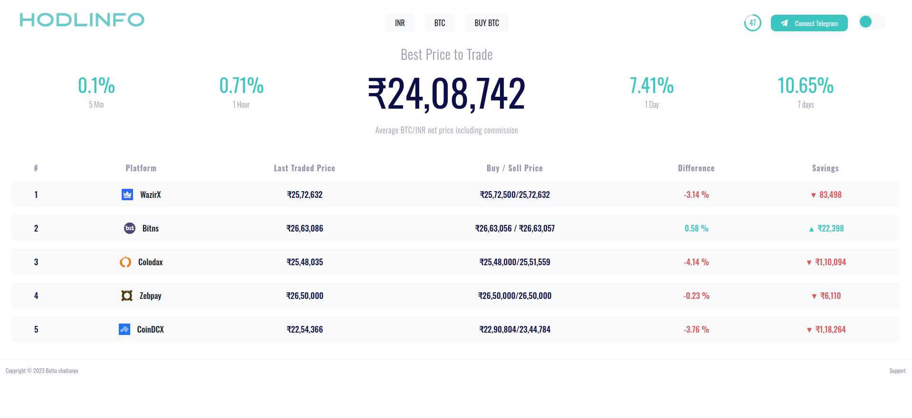

# Hodlinfo App (Internship Project)

This repository contains a copy project created for an internship, inspired by the Hodlinfo web application. The project aims to replicate the basic functionality and design of Hodlinfo, providing cryptocurrency ticker information from various platforms.

## Overview

The Hodlinfo app retrieves cryptocurrency ticker data from an external API, stores it in a MongoDB database, and displays it on a web interface. Users can view the latest cryptocurrency prices, buy/sell prices, and other relevant information.

## Features

- **Real-time Ticker Updates**: Retrieves cryptocurrency ticker data from an external API and updates the MongoDB database.
- **Display Ticker Information**: Renders the latest cryptocurrency ticker information on the web interface.
- **Responsive Design**: Provides a responsive web design for optimal viewing across different devices.

## Technologies Used

- **Node.js**: JavaScript runtime environment for server-side development.
- **Express.js**: Web application framework for Node.js.
- **MongoDB**: NoSQL database used for storing cryptocurrency ticker data.
- **Axios**: Promise-based HTTP client for making API requests.

## Screenshots

Include screenshots of the Hodlinfo app to provide a visual representation of its features and interface.

### dark

### light

